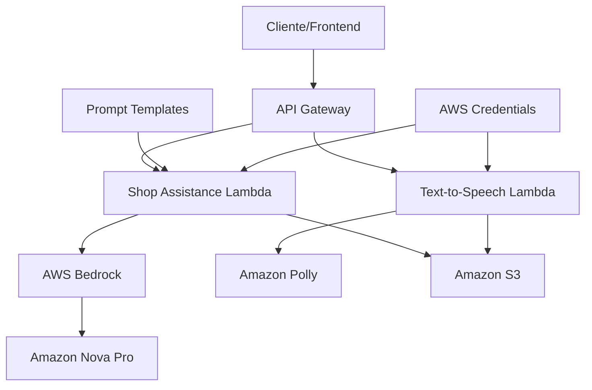

# AWSProject - AI Virtual Assistant

## 👨‍💻 Projeto desenvolvido por: 
[Rafael Torres Nantes](https://github.com/rafael-torres-nantes)

## Índice

* 📚 Contextualização do projeto
* 🛠️ Tecnologias/Ferramentas utilizadas
* 🖥️ Funcionamento do sistema
   * 🧩 Parte 1 - Shop Assistance Lambda
   * 🎙️ Parte 2 - Text-to-Speech Lambda
* 🔀 Arquitetura da aplicação
* 📁 Estrutura do projeto
* 📌 Como executar o projeto
* 🕵️ Dificuldades Encontradas

## 📚 Contextualização do projeto

O projeto tem como objetivo criar um **assistente virtual inteligente para e-commerce** utilizando **AWS Bedrock** e **Amazon Polly**. O sistema foi desenhado para o **iShopMeta**, uma plataforma revolucionária que combina inteligência artificial, realidade aumentada e realidade virtual para criar experiências de compra extraordinárias.

O assistente oferece **descoberta personalizada de produtos**, **filtragem de marcas** e **suporte ao usuário** através de interação por texto, com capacidade de conversão para áudio natural usando tecnologia de **Text-to-Speech**.

## 🛠️ Tecnologias/Ferramentas utilizadas

[](https://www.python.org/)
[](https://code.visualstudio.com/)
[](https://aws.amazon.com/lambda/)
[](https://aws.amazon.com/bedrock/)
[](https://aws.amazon.com/polly/)
[](https://aws.amazon.com/s3/)
[](https://aws.amazon.com/bedrock/)
[](https://boto3.amazonaws.com/v1/documentation/api/latest/index.html)
[](https://pypi.org/project/python-dotenv/)
[](https://github.com/)

## 🖥️ Funcionamento do sistema

### 🧩 Parte 1 - Shop Assistance Lambda

O **AWSLambda-ShopAssistance** é o coração inteligente do sistema, responsável por processar consultas dos usuários sobre produtos e marcas. Utiliza o modelo **Amazon Nova Pro** através do **AWS Bedrock** para fornecer respostas personalizadas e inteligentes.

**Principais funcionalidades:**
* **Prompt Engineering**: Utiliza templates especializados em `PromptTemplate` para o contexto do iShopMeta
* **Processamento de IA**: Integração com `AmazonNovaPro` para respostas naturais
* **Armazenamento**: Salvamento automático de conversas no **S3** via `S3BucketClass`
* **Inferência**: Processamento via `BedrockInferenceService`

### 🎙️ Parte 2 - Text-to-Speech Lambda

O **AWSLambda-TextToSpeech** converte as respostas textuais em áudio natural usando **Amazon Polly**, proporcionando uma experiência de voz realista e envolvente.

**Principais funcionalidades:**
* **TTS Avançado**: Conversão otimizada via `TTSPollyService`
* **Vozes Neurais**: Suporte para vozes neurais de alta qualidade (Joanna, Matthew, etc.)
* **Múltiplos Formatos**: MP3, WAV, OGG Vorbis com controle de velocidade
* **Streaming**: Processamento de textos longos em chunks
* **Otimização**: Retorno direto em base64 para baixa latência

## 🔀 Arquitetura da aplicação



O sistema utiliza **arquitetura serverless** com duas **AWS Lambda Functions** independentes:

1. **Shop Assistance**: Processa consultas de e-commerce usando IA generativa
2. **Text-to-Speech**: Converte respostas em áudio natural
3. **Armazenamento**: S3 para persistência de conversas e arquivos de áudio
4. **Autenticação**: Gerenciamento seguro de credenciais AWS

## Técnicas de Prompt Engineering

### iShopMeta AI Assistant Prompting
O sistema utiliza um prompt especializado para o contexto de e-commerce, incorporando:

**Contexto da Empresa:**
```python
# Exemplo do prompt do iShopMeta Assistant
"""
You are the iShopMeta AI Assistant, a revolutionary retail technology system that transforms 
traditional online shopping into an immersive, interactive experience. You work for iShopMeta, 
a company that seamlessly integrates artificial intelligence, augmented reality, and virtual reality 
technologies to create extraordinary shopping adventures.
"""
```

**Capacidades Técnicas:**
- Descoberta personalizada de produtos
- Filtragem inteligente de marcas
- Recomendações baseadas em preferências
- Integração com APIs de e-commerce
- Suporte multimodal (texto + áudio)

**Formato de Resposta Estruturada:**
```json
{
  "response_type": "product_search|brand_filter|general_assistance",
  "message": "Resposta personalizada",
  "products": [...],
  "suggestions": [...],
  "next_actions": [...]
}
```

## 📁 Estrutura do projeto

```
AWSProject-AIVirtualAssistante/
├── AWSLambda-ShopAssistance/
│   ├── lambda_function.py          # Função Lambda principal
│   ├── controllers/
│   │   ├── conversation_formatter.py
│   │   └── token_manager.py
│   ├── models/
│   │   └── amazon_nova_pro.py      # Modelo Amazon Nova Pro
│   ├── services/
│   │   ├── bedrock_services.py     # Serviço AWS Bedrock
│   │   └── s3bucket_services.py    # Serviço Amazon S3
│   ├── templates/
│   │   └── prompt_template.py      # Templates de prompt
│   ├── utils/
│   │   ├── check_aws.py           # Configuração AWS
│   │   └── import_credentials.py   # Gerenciamento de credenciais
│   ├── .env                       # Variáveis de ambiente
│   └── .env.example              # Exemplo de configuração
│
├── AWSLambda-TextToSpeech/
│   ├── lambda_function.py          # Função Lambda TTS
│   ├── services/
│   │   ├── polly_services.py      # Serviço Amazon Polly
│   │   └── s3bucket_services.py   # Serviço Amazon S3
│   ├── utils/
│   │   ├── check_aws.py          # Configuração AWS
│   │   └── import_credentials.py  # Gerenciamento de credenciais
│   ├── requirements.txt          # Dependências Python
│   ├── README.md                # Documentação TTS
│   ├── .env                     # Variáveis de ambiente
│   └── .env.example            # Exemplo de configuração
│
└── README.md                   # Este arquivo
```

## 📌 Como executar o projeto

### Pré-requisitos
1. **Conta AWS** com acesso ao Bedrock e Polly
2. **Python 3.8+** instalado
3. **Credenciais AWS** configuradas

### Configuração das Credenciais

1. **Configure o arquivo .env em cada Lambda:**
   ```bash
   # Para Shop Assistance
   cd AWSLambda-ShopAssistance
   cp .env.example .env
   # Edite o .env com suas credenciais AWS
   
   # Para Text-to-Speech  
   cd AWSLambda-TextToSpeech
   cp .env.example .env
   # Edite o .env com suas credenciais AWS
   ```

### Execução Local

1. **Teste do Shop Assistance:**
   ```bash
   cd AWSLambda-ShopAssistance
   python lambda_function.py
   ```

2. **Teste do Text-to-Speech:**
   ```bash
   cd AWSLambda-TextToSpeech
   pip install -r requirements.txt
   python lambda_function.py
   ```

### Exemplo de Uso

**Shop Assistance:**
```python
test_event = {
    "query": "Estou procurando uma jaqueta de couro preta para homem, tamanho M, da marca Nike ou Adidas",
    "user_id": "user123", 
    "session_id": "session456"
}
```

**Text-to-Speech:**
```python
test_event = {
    "text": "Hello! Welcome to iShopMeta, your AI shopping assistant.",
    "voice_id": "Joanna",
    "output_format": "mp3",
    "speed": "medium"
}
```

### Deploy na AWS

1. **Compacte cada Lambda em um arquivo ZIP**
2. **Crie as funções Lambda na AWS Console**
3. **Configure as permissões IAM** para Bedrock, Polly e S3
4. **Configure as variáveis de ambiente**
5. **Teste através do AWS Console ou API Gateway**

## 🎯 Funcionalidades Avançadas

### Shop Assistance
- ✅ **Descoberta inteligente de produtos**
- ✅ **Filtragem por marcas e categorias**
- ✅ **Recomendações personalizadas**
- ✅ **Armazenamento de conversas no S3**
- ✅ **Processamento via Amazon Nova Pro**

### Text-to-Speech
- ✅ **Vozes neurais de alta qualidade**
- ✅ **Múltiplos formatos de áudio**
- ✅ **Controle de velocidade da fala**
- ✅ **Streaming para textos longos**
- ✅ **Retorno em base64 para baixa latência**

## 🔧 Configurações de Performance

### Para Máxima Velocidade (TTS)
```python
result = tts.text_to_speech(
    text=your_text,
    voice_id="Joanna", 
    output_format="mp3",
    speed="fast",
    use_neural=False  # Engine padrão é mais rápida
)
```

### Para Máxima Qualidade (TTS)
```python
result = tts.text_to_speech(
    text=your_text,
    voice_id="Joanna",
    output_format="wav", 
    speed="medium",
    use_neural=True  # Engine neural para melhor qualidade
)
```

## 🕵️ Dificuldades Encontradas

Durante o desenvolvimento do projeto, algumas dificuldades foram enfrentadas:

- **Integração com AWS Bedrock:** Configuração das permissões IAM e credenciais temporárias para acesso aos modelos de IA generativa
- **Otimização de Performance:** Balanceamento entre qualidade e velocidade no processamento de TTS, especialmente com vozes neurais
- **Gerenciamento de Contexto:** Desenvolvimento de prompts especializados para o domínio de e-commerce mantendo consistência nas respostas
- **Armazenamento Eficiente:** Implementação de estratégias de upload/download otimizadas para o S3 com arquivos de áudio
- **Tratamento de Erros:** Implementação robusta de tratamento de exceções para diferentes cenários de falha nos serviços AWS

## 📊 Métricas de Performance

### Shop Assistance
- **Tempo de resposta médio:** 2-5 segundos
- **Precisão das respostas:** Otimizada via prompt engineering
- **Armazenamento:** Persistência automática no S3

### Text-to-Speech  
- **Processamento:** 1-3 segundos para textos curtos
- **Qualidade:** Vozes neurais com 24kHz de taxa de amostragem
- **Formatos:** MP3, WAV, OGG Vorbis suportados

## 🔒 Segurança

- ✅ **Credenciais AWS** gerenciadas via IAM roles
- ✅ **Arquivos temporários** removidos automaticamente  
- ✅ **URLs S3 pré-assinadas** com expiração
- ✅ **Logs seguros** sem exposição de dados sensíveis
- ✅ **Validação de entrada** em todos os endpoints