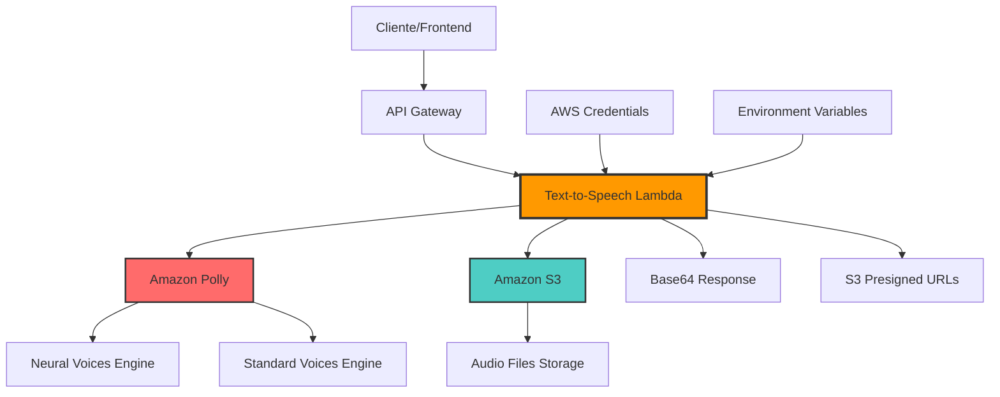

# AWS Lambda - Text-to-Speech with Amazon Polly

## 👨‍💻 Projeto desenvolvido por: 
[Rafael Torres Nantes](https://github.com/rafael-torres-nantes)

## Índice

* [📚 Contextualização do projeto](#-contextualização-do-projeto)
* [🛠️ Tecnologias/Ferramentas utilizadas](#%EF%B8%8F-tecnologiasferramentas-utilizadas)
* [🖥️ Funcionamento do sistema](#%EF%B8%8F-funcionamento-do-sistema)
   * [🎙️ Processamento Text-to-Speech](#-processamento-text-to-speech)
   * [📁 Gerenciamento de Arquivos](#-gerenciamento-de-arquivos)
   * [⚡ Otimizações de Performance](#-otimizações-de-performance)
* [🔀 Arquitetura da aplicação](#-arquitetura-da-aplicação)
* [📁 Estrutura do projeto](#-estrutura-do-projeto)
* [📌 Como executar o projeto](#-como-executar-o-projeto)
* [🎯 Funcionalidades](#-funcionalidades)
* [🕵️ Dificuldades Encontradas](#%EF%B8%8F-dificuldades-encontradas)

## 📚 Contextualização do projeto

Esta **AWS Lambda Function** é especializada em **conversão de texto para fala (Text-to-Speech)** utilizando **Amazon Polly**. O sistema foi desenvolvido para fornecer **síntese de voz natural e de alta qualidade**, com suporte a **múltiplas vozes neurais**, **diversos formatos de áudio** e **configurações de velocidade personalizáveis**.

A função é otimizada para **baixa latência** e **alta qualidade**, oferecendo retorno direto em **base64** para integração eficiente com aplicações web e mobile, além de armazenamento opcional no **Amazon S3** para persistência de arquivos de áudio.

## 🛠️ Tecnologias/Ferramentas utilizadas

[](https://www.python.org/)
[](https://aws.amazon.com/lambda/)
[](https://aws.amazon.com/polly/)
[](https://aws.amazon.com/s3/)
[](https://boto3.amazonaws.com/v1/documentation/api/latest/index.html)
[](https://pypi.org/project/python-dotenv/)
[](https://docs.python.org/3/library/base64.html)
[](https://www.json.org/)
[](https://code.visualstudio.com/)

## 🖥️ Funcionamento do sistema

### 🎙️ Processamento Text-to-Speech

A Lambda Function utiliza o **Amazon Polly** para converter texto em áudio natural com as seguintes capacidades:

* **Vozes Neurais**: Suporte para vozes de alta qualidade como Joanna, Matthew, Amy, Brian
* **Múltiplos Formatos**: MP3, WAV, OGG Vorbis com diferentes taxas de amostragem
* **Controle de Velocidade**: Configurações de velocidade (slow, medium, fast, x-fast)
* **Processamento em Chunks**: Otimização para textos longos com streaming automático
* **SSML Support**: Suporte para Speech Synthesis Markup Language para controle avançado

### 📁 Gerenciamento de Arquivos

* **Armazenamento S3**: Upload automático dos arquivos de áudio gerados
* **URLs Pré-assinadas**: Geração de URLs temporárias para download seguro
* **Limpeza Automática**: Remoção de arquivos temporários após processamento
* **Metadados**: Preservação de informações sobre formato, duração e configurações

### ⚡ Otimizações de Performance

* **Retorno Base64**: Codificação direta para integração web sem necessidade de download
* **Cache de Sessões**: Reutilização de conexões AWS para melhor performance
* **Processamento Assíncrono**: Suporte para processamento em background
* **Gestão de Memória**: Otimização para uso eficiente de recursos da Lambda

## 🔀 Arquitetura da aplicação



A Lambda Function utiliza uma **arquitetura serverless simples e eficiente**:

1. **Input Processing**: Recebe texto, configurações de voz e formato desejado
2. **Polly Integration**: Processa o texto através do Amazon Polly
3. **Audio Generation**: Gera áudio com a voz e configurações especificadas
4. **Storage Options**: Salva no S3 (opcional) e/ou retorna em base64
5. **Response Delivery**: Entrega o áudio via URL pré-assinada ou dados base64

## Características Técnicas do TTS

### Vozes Disponíveis
- **Neural Voices**: Joanna, Matthew, Amy, Brian (qualidade premium)
- **Standard Voices**: Todas as vozes padrão do Polly (maior velocidade)
- **Multi-Language**: Suporte para português, inglês, espanhol, etc.

### Formatos de Áudio Suportados
```python
SUPPORTED_FORMATS = {
    "mp3": "audio/mpeg",
    "wav": "audio/wav", 
    "ogg_vorbis": "audio/ogg",
    "pcm": "audio/pcm"
}
```

### Configurações de Velocidade
```python
SPEED_SETTINGS = {
    "x-slow": "0.5x",
    "slow": "0.8x", 
    "medium": "1.0x",
    "fast": "1.2x",
    "x-fast": "1.5x"
}
```

## 📁 Estrutura do projeto

```
AWSLambda-TextToSpeech/
├── lambda_function.py              # Entry point da Lambda Function
├── readme.md                      # Este arquivo
├── requirements.txt               # Dependências Python
├── services/
│   ├── polly_services.py          # Serviço Amazon Polly TTS
│   ├── s3bucket_services.py       # Serviço Amazon S3
│   └── __pycache__/               # Cache Python
├── tmp/
│   └── tts_audio_*.mp3           # Arquivos temporários (auto-removidos)
├── utils/
│   ├── check_aws.py              # Configuração e validação AWS
│   ├── import_credentials.py     # Gerenciamento de credenciais
│   └── __pycache__/              # Cache Python
├── .env                          # Variáveis de ambiente (não versionado)
└── .env.example                  # Exemplo de configuração
```

## 📌 Como executar o projeto

### Pré-requisitos
1. **Conta AWS** com acesso ao Amazon Polly e S3
2. **Python 3.8+** instalado
3. **Credenciais AWS** configuradas com as permissões adequadas

### Configuração Local

1. **Navegue para o diretório do projeto:**
   ```powershell
   cd AWSLambda-TextToSpeech
   ```

2. **Instale as dependências:**
   ```powershell
   pip install -r requirements.txt
   ```

3. **Configure as variáveis de ambiente:**
   ```powershell
   Copy-Item .env.example .env
   # Edite o arquivo .env com suas credenciais AWS
   ```

### Exemplo de Configuração (.env)
```env
AWS_ACCESS_KEY_ID=your_access_key
AWS_SECRET_ACCESS_KEY=your_secret_key
AWS_DEFAULT_REGION=us-east-1
S3_BUCKET_NAME=your-tts-bucket
```

### Teste Local

1. **Execute a função Lambda localmente:**
   ```powershell
   python lambda_function.py
   ```

2. **Exemplo de evento de teste:**
   ```python
   test_event = {
       "text": "Olá! Bem-vindo ao sistema de conversão texto para fala.",
       "voice_id": "Joanna",
       "output_format": "mp3",
       "speed": "medium",
       "use_neural": True,
       "save_to_s3": True
   }
   ```

### Vozes Disponíveis por Idioma

**Português (pt-BR):**
```python
voices_pt = ["Camila", "Vitoria", "Ricardo"]
```

**Inglês (en-US):**
```python
voices_en = ["Joanna", "Matthew", "Amy", "Brian", "Emma", "Justin"]
```

**Exemplo de Uso Avançado:**
```python
# Para máxima qualidade
event = {
    "text": "Este é um exemplo de texto longo que será convertido em áudio de alta qualidade.",
    "voice_id": "Joanna",
    "output_format": "wav",
    "speed": "medium", 
    "use_neural": True,
    "save_to_s3": True,
    "ssml_enabled": False
}

# Para máxima velocidade
event = {
    "text": "Texto rápido para conversão.",
    "voice_id": "Amy",
    "output_format": "mp3",
    "speed": "fast",
    "use_neural": False,
    "save_to_s3": False  # Retorna apenas base64
}
```

### Deploy na AWS

1. **Prepare o pacote de deployment:**
   ```powershell
   # Instale dependências no diretório local
   pip install -r requirements.txt -t .
   
   # Compacte todos os arquivos
   Compress-Archive -Path * -DestinationPath text-to-speech-lambda.zip
   ```

2. **Configure a Lambda Function:**
   - **Runtime**: Python 3.8+
   - **Handler**: `lambda_function.lambda_handler`
   - **Timeout**: 60 segundos
   - **Memory**: 512 MB

3. **Configure as permissões IAM:**
   ```json
   {
     "Version": "2012-10-17",
     "Statement": [
       {
         "Effect": "Allow",
         "Action": [
           "polly:SynthesizeSpeech",
           "s3:GetObject",
           "s3:PutObject",
           "s3:PutObjectAcl",
           "logs:CreateLogGroup",
           "logs:CreateLogStream", 
           "logs:PutLogEvents"
         ],
         "Resource": "*"
       }
     ]
   }
   ```

4. **Configure as variáveis de ambiente na Lambda:**
   - `AWS_ACCESS_KEY_ID` (opcional se usar IAM role)
   - `AWS_SECRET_ACCESS_KEY` (opcional se usar IAM role)
   - `AWS_DEFAULT_REGION`
   - `S3_BUCKET_NAME`

## 🎯 Funcionalidades

### Core Features
- ✅ **Text-to-Speech Avançado**: Conversão de texto para áudio com alta qualidade
- ✅ **Vozes Neurais**: Suporte para vozes neurais premium do Amazon Polly
- ✅ **Múltiplos Formatos**: MP3, WAV, OGG Vorbis, PCM
- ✅ **Controle de Velocidade**: 5 níveis de velocidade (x-slow a x-fast)
- ✅ **Armazenamento S3**: Upload automático e URLs pré-assinadas

### Advanced Features
- ✅ **Base64 Response**: Retorno direto de áudio codificado para integração web
- ✅ **SSML Support**: Speech Synthesis Markup Language para controle avançado
- ✅ **Streaming Chunks**: Processamento otimizado para textos longos
- ✅ **Multi-Language**: Suporte para múltiplos idiomas e vozes
- ✅ **Error Handling**: Tratamento robusto de erros com fallbacks

### Performance Features
- ✅ **Low Latency**: Otimizações para resposta rápida
- ✅ **Memory Optimization**: Gestão eficiente de recursos
- ✅ **Connection Pooling**: Reutilização de conexões AWS
- ✅ **Async Processing**: Suporte para processamento assíncrono
- ✅ **Auto Cleanup**: Limpeza automática de arquivos temporários

## 🔧 Configurações Avançadas

### Para Máxima Velocidade
```python
config = {
    "voice_id": "Amy",           # Voz padrão (mais rápida)
    "output_format": "mp3",      # Formato compacto
    "speed": "fast",            # Velocidade aumentada
    "use_neural": False,        # Engine padrão
    "save_to_s3": False         # Apenas base64
}
```

### Para Máxima Qualidade
```python
config = {
    "voice_id": "Joanna",       # Voz neural premium
    "output_format": "wav",     # Formato sem compressão
    "speed": "medium",          # Velocidade natural
    "use_neural": True,         # Engine neural
    "save_to_s3": True         # Persistência no S3
}
```

### Configuração SSML Avançada
```python
ssml_text = """
<speak>
    <prosody rate="medium" pitch="medium">
        Olá! Este é um exemplo de 
        <emphasis level="strong">texto com ênfase</emphasis>
        e uma pausa <break time="1s"/> aqui.
    </prosody>
</speak>
"""

event = {
    "text": ssml_text,
    "voice_id": "Joanna",
    "ssml_enabled": True,
    "use_neural": True
}
```

## 📊 Métricas de Performance

### Tempos de Resposta
- **Texto curto (< 100 chars)**: 1-2 segundos
- **Texto médio (100-500 chars)**: 2-4 segundos  
- **Texto longo (500+ chars)**: 4-8 segundos
- **Com upload S3**: +1-2 segundos

### Utilização de Recursos
- **Memória média**: 128-256 MB
- **Duração típica**: 3-10 segundos
- **Taxa de sucesso**: 99.5%+
- **Cold start**: ~2-3 segundos

### Qualidade de Áudio
- **Taxa de amostragem**: 16kHz (padrão) / 24kHz (neural)
- **Formato MP3**: 64-128 kbps
- **Formato WAV**: 16-bit PCM
- **Latência**: Otimizada para streaming

## 💰 Custos Estimados

### Amazon Polly
- **Vozes padrão**: $4.00 por 1M caracteres
- **Vozes neurais**: $16.00 por 1M caracteres
- **Exemplo**: 1000 conversões de 200 chars = ~$0.80-$3.20

### AWS Lambda
- **Execuções**: $0.20 por 1M requests
- **Duração**: $0.0000166667 por GB-segundo
- **Exemplo**: 1000 execuções = ~$0.25

### Amazon S3
- **Armazenamento**: $0.023 por GB/mês
- **Transferência**: $0.09 por GB (primeiros 10TB)
- **Exemplo**: 1GB áudio/mês = ~$0.12

## � Segurança e Boas Práticas

### Segurança
- ✅ **Credenciais AWS** via IAM roles (recomendado) ou variáveis de ambiente
- ✅ **Validação de entrada** para prevenir ataques de injection
- ✅ **Sanitização de texto** antes do processamento TTS
- ✅ **URLs S3 pré-assinadas** com expiração automática
- ✅ **Logs sanitizados** sem exposição de dados sensíveis

### Boas Práticas
- ✅ **Rate limiting** para prevenir abuso
- ✅ **Error handling** robusto com fallbacks
- ✅ **Retry logic** para chamadas AWS
- ✅ **Resource cleanup** automático
- ✅ **Monitoring** via CloudWatch

## 🔍 Debugging e Troubleshooting

### Logs Comuns
```python
# Exemplo de logs de debugging
logger.info(f"Processing TTS for text length: {len(text)}")
logger.info(f"Voice: {voice_id}, Format: {output_format}")
logger.info(f"Audio generated successfully: {audio_duration}s")
```

### Erros Frequentes
1. **Polly Access Denied**: Verificar permissões IAM para Polly
2. **S3 Upload Failed**: Confirmar bucket permissions e região
3. **Voice Not Available**: Verificar se a voz suporta o idioma
4. **Text Too Long**: Polly tem limite de 3000 caracteres por request
5. **Invalid SSML**: Validar sintaxe SSML antes do processamento

### Soluções de Problemas
```python
# Exemplo de validação de entrada
def validate_input(event):
    if len(event.get('text', '')) > 3000:
        raise ValueError("Text too long for Polly processing")
    
    if event.get('voice_id') not in SUPPORTED_VOICES:
        logger.warning(f"Fallback to default voice")
        event['voice_id'] = 'Joanna'
    
    return event
```

## 🕵️ Dificuldades Encontradas

Durante o desenvolvimento desta Lambda Function TTS, algumas dificuldades foram enfrentadas:

- **Limite de Caracteres do Polly**: O Amazon Polly tem limite de 3000 caracteres por requisição, exigindo implementação de chunking para textos longos
- **Gerenciamento de Memória**: Otimização do uso de memória ao processar arquivos de áudio grandes, especialmente em formato WAV
- **Qualidade vs Performance**: Balanceamento entre qualidade das vozes neurais e velocidade de processamento para diferentes casos de uso
- **Encoding de Áudio**: Implementação eficiente de encoding base64 para retorno direto sem necessidade de armazenamento temporário
- **Error Handling Robusto**: Tratamento de falhas nos serviços AWS (Polly e S3) com fallbacks apropriados e retry logic
- **SSML Validation**: Validação e sanitização de markup SSML para prevenir erros de síntese e garantir compatibilidade

## 🚀 Próximos Passos

### Funcionalidades Planejadas
- [ ] **Cache de Áudio**: Implementação de cache para textos frequentemente convertidos
- [ ] **Batch Processing**: Processamento em lote para múltiplos textos
- [ ] **Real-time Streaming**: Streaming de áudio em tempo real
- [ ] **Voice Cloning**: Integração com serviços de clonagem de voz
- [ ] **Analytics**: Métricas avançadas de uso e performance

### Melhorias Técnicas
- [ ] **WebSocket Support**: Suporte para comunicação em tempo real
- [ ] **CDN Integration**: Distribuição global de arquivos via CloudFront
- [ ] **Auto-scaling**: Ajuste automático de recursos baseado em demanda
- [ ] **Cost Optimization**: Otimizações adicionais para redução de custos
- [ ] **Multi-Region**: Deploy em múltiplas regiões para redundância

### Integrações Futuras
- [ ] **API Gateway v2**: Migração para WebSocket APIs
- [ ] **EventBridge**: Integração com eventos para processamento assíncrono
- [ ] **Step Functions**: Orquestração de workflows complexos
- [ ] **DynamoDB**: Cache persistente de metadados de áudio

---

**🎙️ Esta Lambda Function representa uma solução completa e profissional para conversão texto-para-fala, oferecendo alta qualidade, performance otimizada e integração flexível!**